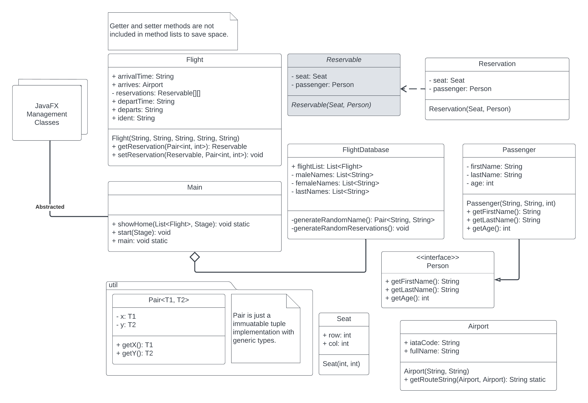

# CS2363 Final Project
## Flight Reservation System

### Preview

### How to Use
In your IDE, JavaFX must be set up correctly so that it can be used as a module by Java. All the source code is in 
the src folder.

The main class and launcher class both have public static void main methods so you can run either class to start the 
program. The launcher class only exists for the JAR file to use.

### UML Diagram

